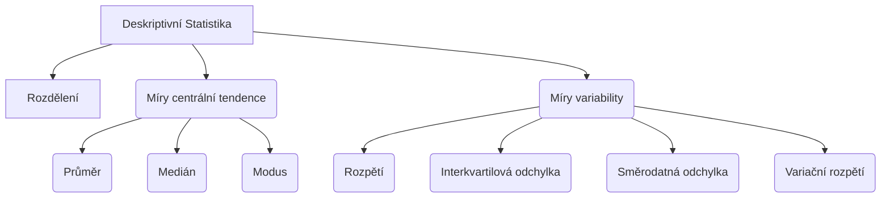

---
{"dg-publish":true,"permalink":"/Vzdělávání/Statistika na první test/"}
---

[[Vzdělávání/Vzorečky na statistiku\|Vzorečky na statistiku]]
[[Vzdělávání/Statistika 1. hodina Úvod do statistiky\|Statistika 1. hodina Úvod do statistiky]]
[[Vzdělávání/Statistika 2. hodina Deskriptivní statistika\|Statistika 2. hodina Deskriptivní statistika]]
[[Vzdělávání/Statistika 3. hodina  Univariační analýza  numerické charakteristiky\|Statistika 3. hodina  Univariační analýza  numerické charakteristiky]]
[[Vzdělávání/Statistika 4. hodina Počítání s dekriptivní statistikou\|Statistika 4. hodina Počítání s dekriptivní statistikou]]
[[Vzdělávání/Statistika 5. hodina Bivariační analýza\|Statistika 5. hodina Bivariační analýza]]
[[Vzdělávání/Statistika 6. hodina Korelace\|Statistika 6. hodina Korelace]]

# Deskriptivní statistika

## Rozdělení frekvencí
- taky frekvenční rozdělení 
- data v tabulce nebo grafu můžeme shrnout četnost každé hodnoty v číslech nebo procentech

## Míry centrální tendence
### Průměr (mean, $\bar{x}$)
- sečteme všechny hodnoty a vydělíme součet celkovým počtem.
$$\bar{x} = \frac{\sum_{i=1}^{n} x_i}{n}$$

### Medián (med,Q2)

 střední hodnota souboru, který je seřazen od nejmenší po největší hodnotu

$$ x= {\frac {n+1}{2}}$$

- pokud sudý počet čísel, tak průměr dvou prostředních hodnot

$$\text{Median} = \frac{x_{\frac{n}{2}} + x_{\frac{n}{2} + 1}}{2}$$
### Modus
- nejčastější hodnota v souboru

## Míry variability

- dávají představu o tom, jak rozložené jsou hodnoty

### Rozpětí
- rozdíl mezi největší a nejmenší hodnotou v souboru
- $$R = x_{max}- x_{min}$$

### Interkvartilová odchylka
-  rozdíl mezi horním (třetím) a dolním (prvním) kvartilem
- Vzorce:
- $$RQ = Q_{3}- Q_{1}$$
- nebo taky
- $$Q= x_{0,75}- x_{0,25}$$

#### Kvartily
**Q1  $\frac{1}{4}(n+1)$**
**Q2  $\frac{2}{4}(n+1)$**
**Q3 $\frac{3}{4}(n+1)$**
**Q4 maximum**

### Rozptyl a Směrodatná odchylka
Rozptyl je průměr čtverců odchylek od průměru

**Vzorec rozptylu:**

$$\sigma^2 = \frac{1}{n} \sum_{i=1}^{n} (x_i - \bar{x})^2
$$

Směrodatná odchylka v průměru řekne, jak daleko leží každé skóre od průměru

**Vzorec směrodatné odchylky**
$$\sigma = \sqrt{\frac{1}{n} \sum_{i=1}^{n} (x_i - \bar{x})^2}
$$

### Variační koeficient
jestliže chceme posoudit relativní velikost rozptýlenosti dat vzhledem k průměru
- Jako podíl standardní odchylky a průměru

$$CV = \left(\frac{\text{SD}}{\bar{x}}\right) \times 100\%
$$

# Korelační koeficienty
## Pearsonův
popisuje lineární vztah mezi dvěma kvantitativními proměnnými.

**předpoklady, které musí data splňovat, pokud chcete použít Pearsonovo r:**

- Obě proměnné jsou na intervalové nebo poměrové úrovni měření
- Data z obou proměnných mají normální rozdělení
- Vaše data nemají žádné odlehlé hodnoty
- Vaše data pocházejí z náhodného nebo reprezentativního vzorku
- Očekáváte lineární vztah mezi dvěma proměnnými

je parametrický test, takže má vysoký výkon

Ale není to dobré měřítko korelace, pokud mají  proměnné nelineární vztah nebo pokud  data mají odlehlé hodnoty, zkreslená rozdělení nebo pocházejí z kategorických proměnných

**Vzorec**
$$r = \frac{\sum{(x_i - \bar{x})(y_i - \bar{y})}}{\sqrt{\sum{(x_i - \bar{x})^2} \sum{(y_i - \bar{y})^2}}}
$$

## Spermanův
nejběžnější alternativou k Pearsonově 

Je to korelační koeficient pořadí, protože používá pořadí dat z každé proměnné (např. od nejnižší po nejvyšší) spíše než samotná nezpracovaná data

Spearmanův byste měli použít, když vaše data nesplňují předpoklady Pearsonova 

K tomu dochází, když je alespoň jedna z vašich proměnných na ordinální úrovni měření nebo když data z jedné nebo obou proměnných nesledují normální rozdělení.

Zatímco Pearsonův korelační koeficient měří linearitu vztahů, Spearmanův korelační koeficient měří monotónnost vztahů

V lineárním vztahu se každá proměnná mění v jednom směru stejnou rychlostí v celém rozsahu dat

V monotónním vztahu se také každá proměnná vždy mění pouze jedním směrem, ale ne nutně stejnou rychlostí.

- Pozitivní monotónní: když se jedna proměnná zvyšuje, zvyšuje se i druhá.
- Negativní monotónní: když se jedna proměnná zvyšuje, druhá klesá.

**Vzorec:**
Základní
$$\rho = 1 - \frac{6\sum (x_i - y_i)^2}{n(n^2 - 1)}
$$
Upravený o diviaci $d_i$ - rozdíl mezi x a y
$$\rho = 1 - \frac{6\sum (d_i)^2}{n(n^2 - 1)}

$$
Pro fajnšmekry, kompletně upravený
$$\rho = 1 - \frac{6\sum (d_i)^2}{n^{3}-n}
$$

## Kendalův

- měří vztah mezi dvěma sloupci seřazených dat
- není potřeba aby data byla normálně rozdělena

**Vzorec**
C - konrodtantní, +, jsou větší, souhlasné páry
D - diskonkordatní, -, jsou měnší, nesouhlasné páry

$$\tau=\frac{C-D}{C+D}$$

> [!task]+ Příklad
> Dva učitelé seřadí 12 svých žáků od nejhoršího po nejlepšího. Máme dva sloupce hodnocených dat, je vhodné použít Kendalla
> Budeme se dívat pouze na pozice u Učitele dva.

| Hráč   | Učitel 1 | Učitel 2 |
| ------ | -------- | -------- |
| Aj     |     1     |   <mark style="background: #FFB86CA6;">1</mark>      |
| Ben    |     2     |      2    |
| Ellito |     3     |    3      |
| Conner |     4     |     5     |
| Duane  |     5     |     4     |
| Frank  |    6      |     7     |
| Greg   |    7      |     6     |
| Hank   |    8      |      8    |
| Isaiah |     9     |      10    |
| Jim    |     10     |     9     |
| Kurt   |    11      |      11    |
| Luke   |     12     |     12     |

>[!warning]- Řešení
>Od prvního hráče, o kolik pozic pod ním jsou větší. Pod 1 je 11 větších - konkordantních.
>Pod dvojkou je 10 větších.
>Takhle pro všechny hráče až k nule
>Diskorkodantní kolik pozic je menších. Pokud není žádný tak píšeme nulu.
>Suma C 63
>Suma D 3
>Kendallovo Tau = 0,909

